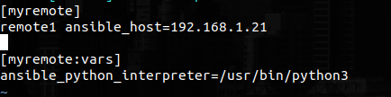
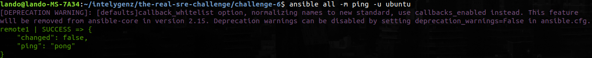

# Challenge 6

Setup commands on Ansible Node (my machine):

```
$ sudo apt update && sudo apt-add-repository -y --update ppa:ansible/ansible
$ sudo apt update
$ sudo apt install ansible -y
```

- Add the server on the inventory.

```
$ sudo vim /etc/ansible/hosts
```


```
$ ansible all -m ping -u ubuntu
```


- Install docker.
  build the image from Dockerfile (challenge-4).
  Deploy the image on the server:

> Edit main.yml to complete it:
```
$ vim main.yml:
```

I changed the ports because I have other dockers on that ports on same Raspberry.

Apply playbook:

```
$ ansible-playbook main.yml -l myremote -u ubuntu
```

- Check if HTTP server is running and response properly.

```
$ curl --header "Challenge: intelygenz.com" 192.168.1.21:83
```

> Output:

Everything works!

- Save the output of the ansible-playbook execution in ansible.log file and upload.

```
$ ansible-playbook main.yml -l myremote -u ubuntu > ansible.log
```

I commented the docker installation steps because I had already docker installed on my raspberry.

- Group tasks with tags.

> Edit main.yml with "tags: foo" depends on the step process and if I want it to be executed allways or not.
