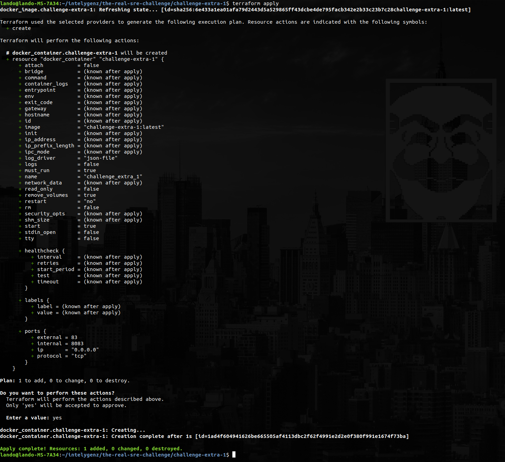

# Challenge Extra 1 Terraform

In this case I will use local unix docker service.

After install terraform. Executed commands:

Commands:

```
$ terraform init
$ terraform validate
$ terraform plan
$ teraform apply
```



After that, to add http request alive and apply final plan:

```
$ vim http.tf #Add dependency http
$ terraform init -upgrade
$ terraform plan -out tffinalplan
$ terraform apply tffinalplan > terraform-apply-output.log
```
