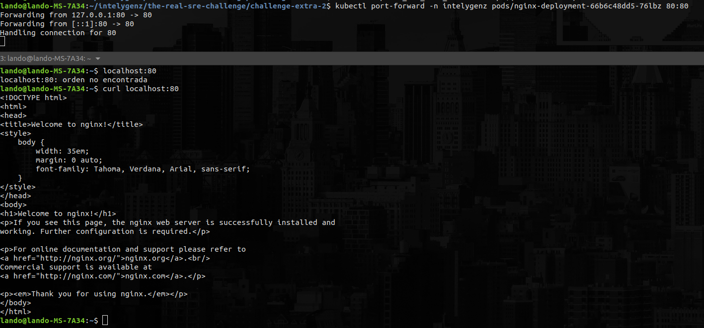

# Extra Challenge 2 Kubernetes

Installed minikube as a cluster (I have it already installed)
Using kubectl as an interface for k8s cluster

Command for applying manifest:

```
$ kubectl apply -f manifests/
```

- Get all namespaces.

```
$ kubectl get namespaces
```

> Output:

NAME              STATUS   AGE
collector         Active   116s
default           Active   124d
integration       Active   115s
intelygenz        Active   115s
kube-node-lease   Active   124d
kube-public       Active   124d
kube-system       Active   124d
monitoring        Active   115s
tools             Active   115s

- Get all pods from all namespaces.

```
$ kubectl get pods --all-namespaces
```

> output:

NAMESPACE     NAME                                READY   STATUS    RESTARTS       AGE
integration   pod-example-integration             1/1     Running   0              3m55s
intelygenz    nginx-deployment-66b6c48dd5-76lbz   1/1     Running   0              3m55s
intelygenz    nginx-deployment-66b6c48dd5-m2wh8   1/1     Running   0              3m55s
intelygenz    nginx-deployment-66b6c48dd5-qbrx8   1/1     Running   0              3m55s
intelygenz    pod-example-intelygenz              1/1     Running   0              3m55s
kube-system   coredns-78fcd69978-92vtz            1/1     Running   1 (124d ago)   124d
kube-system   etcd-minikube                       1/1     Running   1 (124d ago)   124d
kube-system   kube-apiserver-minikube             1/1     Running   1 (6m ago)     124d
kube-system   kube-controller-manager-minikube    1/1     Running   1 (124d ago)   124d
kube-system   kube-proxy-dbqfw                    1/1     Running   1 (124d ago)   124d
kube-system   kube-scheduler-minikube             1/1     Running   1 (6m ago)     124d
kube-system   storage-provisioner                 1/1     Running   2 (124d ago)   124d
monitoring    pod-example-monitoring              1/1     Running   0              3m55s
tools         pod-nginx-tools                     1/1     Running   0              3m55s

- Get all resources from all namespaces.

```
kubectl api-resources --verbs=list --namespaced -o name   | xargs -n 1 kubectl get --show-kind --ignore-not-found --all-namespaces
```

> Output:
Output in all-resources-all-namespaces.txt file


- Get all services from namespace intelygenz.

```
kubectl get services -n intelygenz
```

> Output:

NAME            TYPE        CLUSTER-IP     EXTERNAL-IP   PORT(S)   AGE
nginx-service   ClusterIP   10.106.52.99   <none>        80/TCP    10m


- Get all deployments from tools.

```
kubectl get deployments -n tools
```

> Output:

No resources found in tools namespace.

- Get image from nginx deployment on intelygenz namespace.

```
kubectl get deployments -o wide -n intelygenz
```

> Output:

NAME               READY   UP-TO-DATE   AVAILABLE   AGE   CONTAINERS   IMAGES         SELECTOR
nginx-deployment   3/3     3            3           13m   nginx        nginx:1.14.2   app=nginx

IMAGEN: nginx:1.14.2

Alternative command:

```
kubectl get pods -n intelygenz -o jsonpath="{.items[*].spec.containers[*].image}" |\
tr -s '[[:space:]]' '\n' |\
sort |\
uniq -c
```

> Output:

1 alpine
3 nginx:1.14.2

- Create a port-forward to access nginx pod on intelygenz namespace.

```
kubectl port-forward -n intelygenz pods/nginx-deployment-66b6c48dd5-76lbz 80:80
```

> Output:

Forwarding from 127.0.0.1:80 -> 80
Forwarding from [::1]:80 -> 80

If I make a request with curl to 127.0.0.1:80

```
<!DOCTYPE html>
<html>
<head>
<title>Welcome to nginx!</title>
<style>
    body {
        width: 35em;
        margin: 0 auto;
        font-family: Tahoma, Verdana, Arial, sans-serif;
    }
</style>
</head>
<body>
<h1>Welcome to nginx!</h1>
<p>If you see this page, the nginx web server is successfully installed and
working. Further configuration is required.</p>

<p>For online documentation and support please refer to
<a href="http://nginx.org/">nginx.org</a>.<br/>
Commercial support is available at
<a href="http://nginx.com/">nginx.com</a>.</p>

<p><em>Thank you for using nginx.</em></p>
</body>
</html>
```


